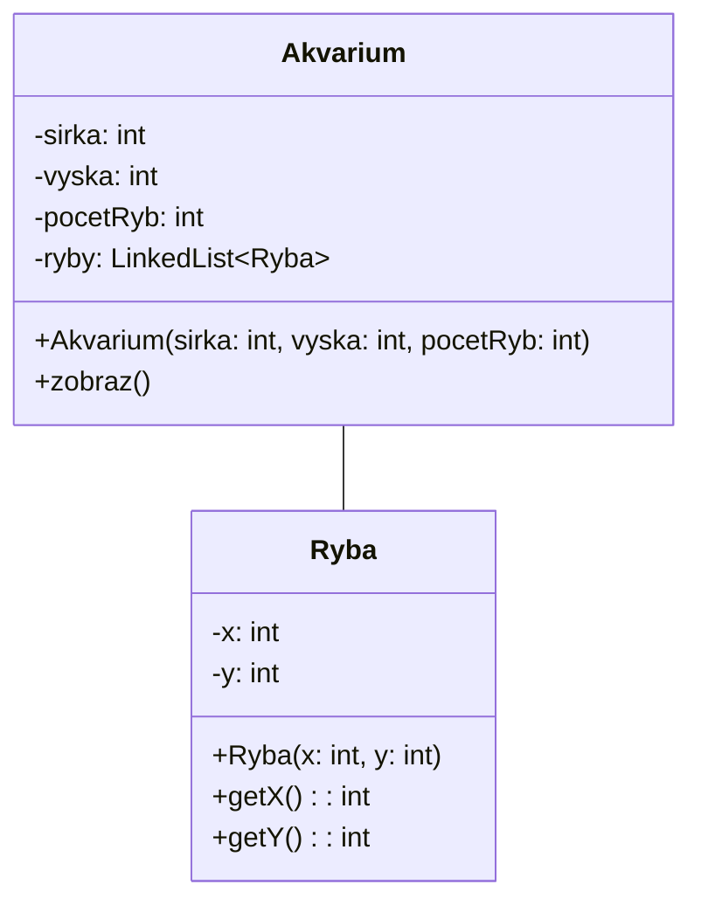

```mermaid
classDiagram
    class Ryba{
        -x: int
        -y: int
        +Ryba(x: int, y: int)
        +getX(): int
        +getY(): int
    }
    class Akvarium{
        -sirka: int
        -vyska: int
        -pocetRyb: int
        -ryby: LinkedList~Ryba~
        +Akvarium(sirka: int, vyska: int, pocetRyb: int)
        +zobraz()
    }
    Akvarium -- Ryba
```