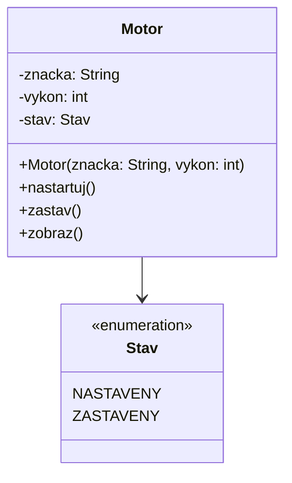
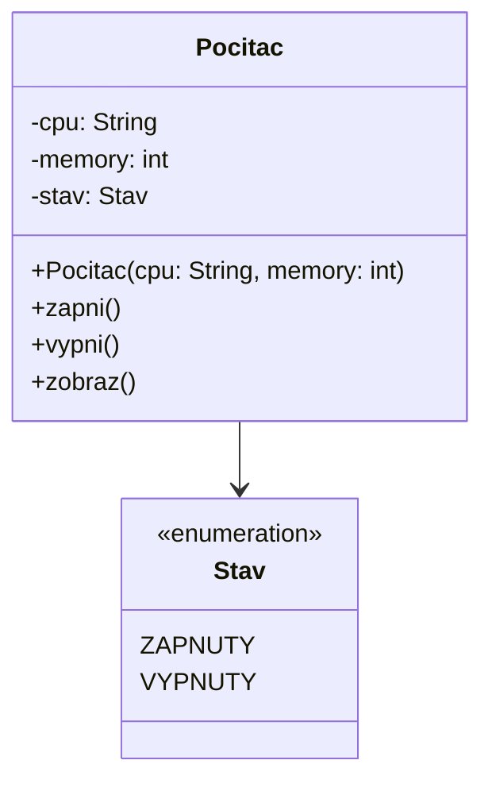

1. Podľa nasledovného UML diagramu implementujte triedy. Pokúste sa odhadnúť (a navrhnúť) vhodnú implementáciu metód. V
   metóde main vytvorte príklad vytvorenia inštancie triedy a demonštrujte volanie metód.

2. Podľa nasledovného UML diagramu implementujte triedy. Pokúste sa odhadnúť (a navrhnúť) vhodnú implementáciu metód. V
   metóde main vytvorte príklad vytvorenia inštancie triedy a demonštrujte volanie metód.

