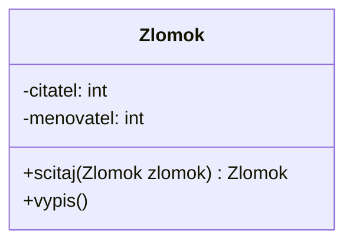

# Uloha: Zlomok

Vytvorte triedu ``Zlomok``, 
s atribútmi ``čitateľ`` a ``menovateľ`` a metódou ``sčítaj``, 
ktorá očakáva, ako parameter zlomok a vracia novú inštanciu zlomku, 
ktorá bude súčtom daných zlomkov. 
Metóda ``výpis`` zobrazí zlomok v 3 riadkoch (čitateľ, zlomková čiara, menovateľ).

