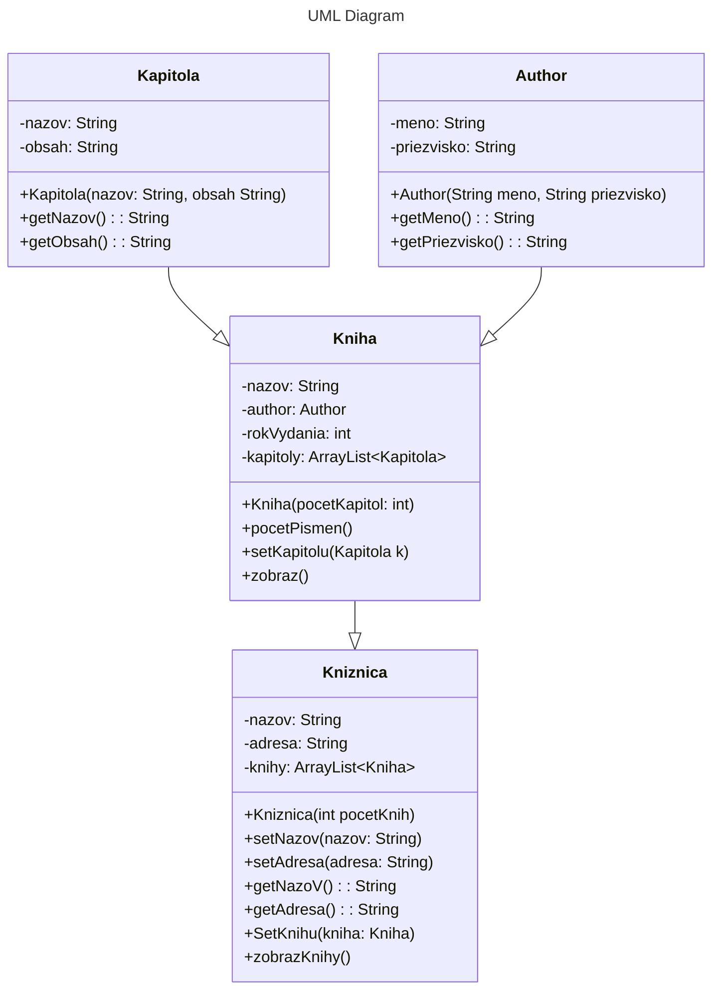

# Uloha: Kniha

Namodelujte knihu,
ktorá je opísaná názvom, autorom, rokom vydania a kapitolami.
Počet kapitol sa určí parametrom konštruktora pri vytváraní inštancie knihy.
Každá kapitola má názov a obsah (rozumej text).
Knihu je možné zobraziť (zobrazia sa všetky kapitoly).
Kniha ďalej bude mať funkciu (metódu) na spočítanie všetkých písmen (znakov) v celej knihe.

Časť 2: Rozšírte príklad o koncept Knižnice (Knižnica má tiež svoj názov, adresu, a pole kníh, ktoré sa v nej
nachádzajú).

