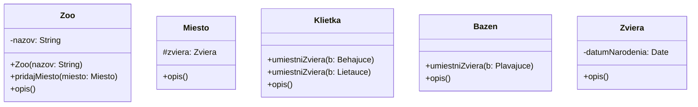

```mermaid
classDiagram
class Zoo {
    -nazov: String
    +Zoo(nazov: String)
    +pridajMiesto(miesto: Miesto)
    +opis()
}
class Miesto {
    #zviera: Zviera
    +opis()
}
class Klietka {
    +umiestniZviera(b: Behajuce)
    +umiestniZviera(b: Lietauce)
    +opis()
}
class Bazen {
    +umiestniZviera(b: Plavajuce)
    +opis()
}
class Zviera {
    -datumNarodenia: Date
    +opis()
}
```